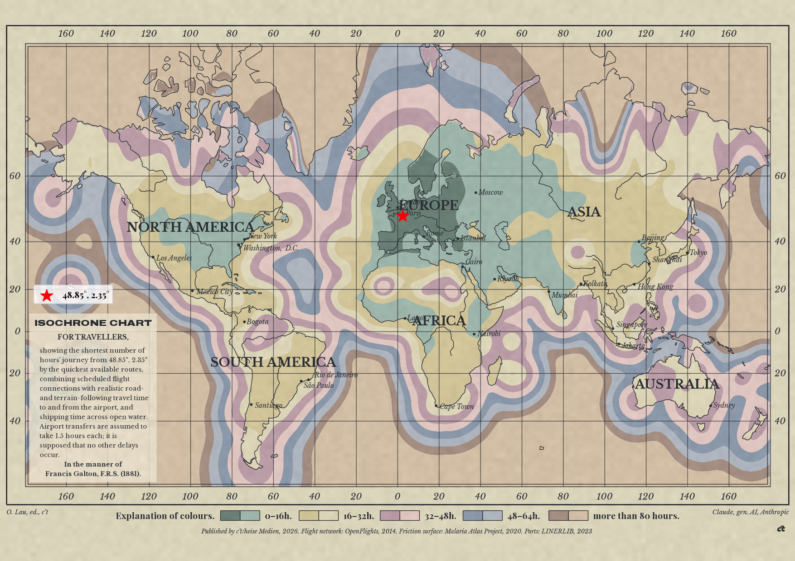

# Isochrone Map

A modern take on Francis Galton's 1881 travel-time map: how long does it
take to reach any point in the world from London, given the global
flight network, plus a rough estimate of the "last mile" by road or sea?

## Idea

Flight *routes* (which airports connect to which) change slowly — the
big hub structure of the network is fairly stable over time, even if
individual schedules and prices are not. So this project deliberately
mixes two data sources of very different age:

- an old (~2014) OpenFlights route dataset, used only for **network
  topology** (who flies where),
- a current airport reference database, used for **coordinates**.

Flight time per route is *estimated* from great-circle distance (a rule
of thumb, not real schedules), and the fastest path from London to
every other airport is computed with Dijkstra's algorithm, including a
fixed per-connection transfer penalty. That gives every *airport* a
travel time. To turn that into a full world map, a global
[H3](https://h3geo.org/) hex grid is laid over the planet, and every
cell — land or water — is assigned the travel time of whichever
airport or port serves it fastest, including the "last mile" from that
hub to the cell itself (by road or by sea).

## Example



To reproduce this exact map after a fresh clone:

```bash
pipenv install
pipenv run python doc/main.py                 # -> doc/travel_times.csv, read by friction_surface_global.py below

mkdir -p friction_data
curl -L -o friction_data/friction_surface.zip \
  "https://data.malariaatlas.org/geoserver/ows?service=CSW&version=2.0.1&request=DirectDownload&ResourceId=Explorer:2020_motorized_friction_surface"
unzip -o friction_data/friction_surface.zip -d friction_data
pipenv run python friction_surface_global.py  # ~1-2 min, builds & caches the global land-friction graph (~744 MB unzipped raster)

pipenv run python3 friction_map_from_point.py \
  --label Hannover --dpi 100 -r 4 --galton \
  52.3796308 9.6789009
```

For everything else — full script/data reference, `--galton`/`--paper`/
`--heli` and other flags, the anisotropic friction-surface pipeline and
its extra downloads, known simplifications — see
[doc/reference.md](doc/reference.md).
